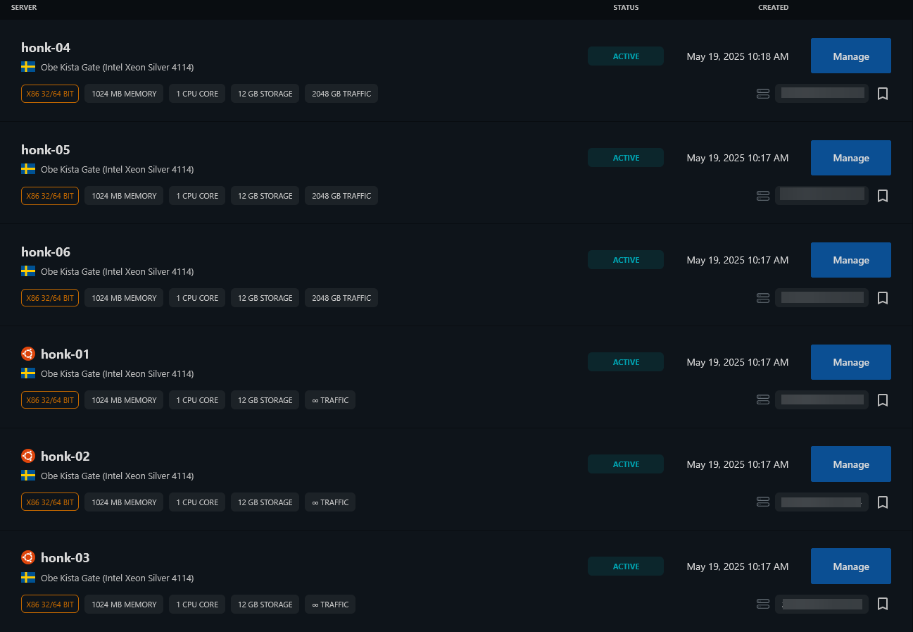

## honk api
*bar harbor forever!*

silly botnet for [internet roadtrip](https://neal.fun/internet-roadtrip/), made by [@nikakasd](https://t.me/nikakasd) and [@w2ppx](https://t.me/kindacoral), was defeated on 20.05.2025 at 16:53 utc by [implementing captcha](https://discord.com/channels/1370059928185864242/1370075065659429057/1374067410751197265), which made botting expensive.

the botnet used [stargate](https://github.com/lanrat/stargate) as a rotating ipv6 proxy on 6 servers.

all code is provided "as is," and no support is provided.